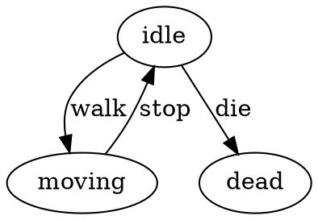

<p align="center">
  <a href="https://github.com/txt/guru26spr/blob/main/README.md"></a>
  <a href="https://github.com/txt/guru26spr/blob/main/docs/lect/syllabus.md"></a>
  <a href="https://docs.google.com/spreadsheets/d/1xZfIwkmu6hTJjXico1zIzklt1Tl9-L9j9uHrix9KToU/edit?usp=sharing"></a>
  <a href="https://moodle-courses2527.wolfware.ncsu.edu/course/view.php?id=8119"></a>
  <a href="https://discord.gg/vCCXMfzQ"></a>
  <a href="https://github.com/txt/guru26spr/blob/main/LICENSE.md"></a></p>
<h1 align="center">:cyclone: CSC491/591: How to be a SE Guru <br>NC State, Spring '26</h1>
 


## Your own DSL

### Q0. Better Coding. [Machine2.lua](machine2.lua) has at least four  clumsy / uncesssary idioms.
Fix them with help funtions that make the DSL beautiful.

For example, there is a fix one clumsty idiom (and you must find  and fix 3 more).


- String concatenation spam      
"[" .. p.name .. "] is idling. HP: " .. p.hp is copy-pasted with tiny variations into every action. It's noisy and typo-prone. A say("is idling. HP: {hp}") closure would say the same thing in a tenth of the characters.

Fix:

```
local function say(msg)
  return function(p)
    print(string.format("[%s] %s", p.name, msg:gsub("{hp}", p.hp))) end end
```
Now instead of:

      action = function(p) print("[" .. p.name .. "] is idling. HP: " .. p.hp) end

you can write:

       action = say("is idling. HP: {hp}")


## Q1 — Trace Tool

**Problem:** When an FSM misbehaves you have no history.

**Task:** Without breaking TCO, record every transition in
`p.trace` as `"[walk] idle -> moving"`. Add a helper that
prints the trace after the FSM finishes.

**Constraint:** The append must happen *before* the tail call,
which is fine — TCO only requires the recursive call be the
*last* thing returned, not the last line in the function.

---

## Q2 — Linter (Static Analyzer)

**Problem:** Typos in state names fail silently at runtime.

**Task:** Write `lint(rules, initial)` that prints warnings for:

1. **Ghost state** — a transition target not in `rules`
2. **Dead end** — a state with no `transitions` (unless terminal)
3. **Unreachable state** — no other state transitions to it
   (excluding `initial`)

Call it before `machine.start`.

---

## Q3 — Guards (Conditional Transitions)

**Problem:** Transitions are unconditional; you can't say
"only attack if stamina > 10".

**Task:** Allow a transition value to be a *function* instead
of a string. Update the engine so that if the transition is a
function it calls it with `p` and uses the returned string.

Example rule:
```lua
attack = function(p)
  return p.stamina > 10 and "attacking" or "idle" end
```

---

# Q4 — Wildcard Transition

**Problem:** Unknown events silently do nothing — the FSM
stays in the current state with no warning.

**Task:** Add support for a `"*"` key in `transitions`. If
an event has no explicit transition, fall back to `"*"` before
defaulting to stay-put. One line changes in the engine.

Example rule:
```lua
idle = {
  action      = say("is idling."),
  transitions = { walk="moving", ["*"]="error" }
}
```

**Question:** Where exactly in `fsm2.lua` do you add the
fallback? Write the new line.

---

# Q5 — DOT Exporter

## Tiny Graphviz Tutorial

Graphviz is a free tool that draws graphs from a plain-text
description called DOT. Install it once:

```bash
brew install graphviz        # mac
sudo apt install graphviz    # linux
```

A DOT file looks like this:



Save it as `fsm.dot`, then render it:

```bash
dot -Tpng fsm.dot -o fsm.png
open fsm.png
```

That's it. `digraph` means directed graph (arrows).
Each line is one edge. `label` is the event name.

---

**Problem:** You can't see your FSM — bugs hide in the graph
structure.

**Task:** Write `to_dot(rules)` that reads the `rules` table
and prints a valid DOT string. No engine changes needed —
`rules` is just a Lua table.

Expected output for `machine2.lua`:

```dot
digraph fsm {
  idle -> moving     [ label="walk"    ]
  idle -> attacking  [ label="attack"  ]
  idle -> staggered  [ label="hit"     ]
  idle -> dead       [ label="die"     ]
  moving -> idle     [ label="stop"    ]
  ...
}
```


--------------
A1:

1. String concatenation spam   
"[" .. p.name .. "] is idling. HP: " .. p.hp is copy-pasted with tiny variations into every action. It's noisy and typo-prone. A say("is idling. HP: {hp}") closure would say the same thing in a tenth of the characters.
2. Transition copy-paste   
hit = "staggered", die = "dead" appears in every state. Add a new global event (say, pause) and you have to touch every state. A mix({...}) helper that merges common transitions would DRY this out.
3. Raw data-structure ops inside business logic  
table.remove(p.damage\_queue, 1) and table.insert(p.queue, 1, "die") expose the how (array manipulation) where only the what should live. pop\_damage(p) and inject(p,"die") make the staggered action readable as plain English.
4. No action composition   
The staggered action does three distinct things — apply damage, log it, maybe inject an event — jammed into one big anonymous function. With a combine(f,g,h) helper each concern becomes a separate named piece and you can mix and match them across states.

i```
local machine = require"fsm3"

-- 1. Closure: returns an action function
local function say(msg)
  return function(p)
    print(string.format("[%s] %s", p.name,
      msg:gsub("{hp}", p.hp))) end end

-- 2. Semantic helpers
local function pop_damage(p)
  return table.remove(p.damage_queue, 1) or 0 end
local function inject(p, e)
  table.insert(p.queue, 1, e) end

-- 3. Composer: runs several actions in sequence
local function combine(...)
  local fns = {...}
  return function(p)
    for _, f in ipairs(fns) do f(p) end end end

-- 4. Mixin: merge common transitions into every state
local common = { hit = "staggered", die = "dead" }
local function mix(t)
  for k, v in pairs(common) do t[k] = v end
  return t end

-- ---- rules ----------------------------------------
local rules = {
  idle = {
    action      = say("is idling. HP: {hp}"),
    transitions = mix{ walk="moving", attack="attacking" }
  },
  moving = {
    action      = say("is walking forward."),
    transitions = mix{ stop="idle", attack="attacking" }
  },
  attacking = {
    action      = say("swings their weapon!"),
    transitions = mix{ recover="idle" }
  },
  staggered = {
    action = combine(
      function(p) p.hp = p.hp - pop_damage(p) end,
      say("took damage! HP: {hp}"),
      function(p)
        if p.hp <= 0 then inject(p, "die") end end
    ),
    transitions = mix{ recover="idle" }
  },
  dead = {
    action      = say("has collapsed."),
    transitions = { revive="idle" }
  }
}

-- ---- payload --------------------------------------
local hero = {
  name = "Hero", hp = 100,
  queue = {
    "walk","attack","recover",
    "hit","recover",
    "walk","attack",
    "hit","walk"
  },
  damage_queue = { 15, 90 }
}

print("=== STARTING ===")
local m = machine.start(rules, "idle", hero)
print("\n=== DONE ===")
print("Queue left: " .. #m.queue)
print("Final HP:   " .. m.hp)
```

# Solutions: Q1 — Q5

---

## Q1 — Trace Tool

```lua
-- fsm_q1.lua
local M = {}

local function run(rules, s, p)
  if rules[s] and rules[s].action then rules[s].action(p) end
  local e = table.remove(p.queue, 1)
  if not e then return p end
  local nx = rules[s].transitions[e] or s
  p.trace[#p.trace+1] = string.format("[%s] %s -> %s", e, s, nx)
  return run(rules, nx, p) end

function M.start(rules, s, p)
  p.trace = {}
  p = run(rules, s, p)
  for _, t in ipairs(p.trace) do print(t) end
  return p end

return M
```

The append happens *before* the tail call — TCO is preserved
because the recursive `return run(...)` is still the last thing
returned.

---

## Q2 — Linter

```lua
-- lint.lua
local function lint(rules, initial, terminal)
  terminal = terminal or { dead=true }
  local reached = { [initial]=true }
  for _, def in pairs(rules) do
    for _, tgt in pairs(def.transitions or {}) do
      reached[tgt] = true end end
  for s, def in pairs(rules) do
    for evt, tgt in pairs(def.transitions or {}) do
      if not rules[tgt] then
        print("GHOST: '"..tgt.."' (from "..s.."["..evt.."])")
      end end
    if not def.transitions and not terminal[s] then
      print("DEAD END: '"..s.."'") end
    if s ~= initial and not reached[s] then
      print("UNREACHABLE: '"..s.."'") end end end

return lint
```

Usage — call before `machine.start`:
```lua
local lint = require"lint"
lint(rules, "idle")
```

---

## Q3 — Guards

Only one line changes in the engine:

```lua
-- fsm_q3.lua
local M = {}

local function run(rules, s, p)
  if rules[s] and rules[s].action then rules[s].action(p) end
  local e = table.remove(p.queue, 1)
  if not e then return p end
  local t  = rules[s].transitions[e]
  local nx = (type(t) == "function" and t(p) or t) or s
  return run(rules, nx, p) end

function M.start(rules, s, p) return run(rules, s, p) end

return M
```

Example guard rule:
```lua
attack = function(p)
  return p.stamina > 10 and "attacking" or "idle" end
```

---

## Q4 — Wildcard Transition

One extra lookup in the engine:

```lua
-- fsm_q4.lua
local M = {}

local function run(rules, s, p)
  if rules[s] and rules[s].action then rules[s].action(p) end
  local e = table.remove(p.queue, 1)
  if not e then return p end
  local t  = rules[s].transitions
  local nx = t[e] or t["*"] or s
  return run(rules, nx, p) end

function M.start(rules, s, p) return run(rules, s, p) end

return M
```

Example rule:
```lua
idle = {
  action      = say("is idling."),
  transitions = { walk="moving", ["*"]="error" }
}
```

Any unrecognised event now routes to `"error"` instead of
silently doing nothing.

---

## Q5 — DOT Exporter

```lua
-- to_dot.lua
local function to_dot(rules)
  print("digraph fsm {")
  for s, def in pairs(rules) do
    for evt, tgt in pairs(def.transitions or {}) do
      print(string.format('  %s -> %s [ label="%s" ]',
        s, tgt, evt)) end end
  print("}") end

return to_dot
```

Usage:
```lua
local to_dot = require"to_dot"
to_dot(rules)           -- paste output into fsm.dot
```

Then render:
```bash
dot -Tpng fsm.dot -o fsm.png
open fsm.png            # mac
xdg-open fsm.png        # linux
```
