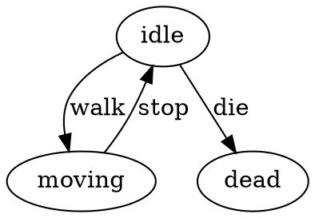

<p align="center">
  <a href="https://github.com/txt/guru26spr/blob/main/README.md"></a>
  <a href="https://github.com/txt/guru26spr/blob/main/docs/lect/syllabus.md"></a>
  <a href="https://docs.google.com/spreadsheets/d/1xZfIwkmu6hTJjXico1zIzklt1Tl9-L9j9uHrix9KToU/edit?usp=sharing"></a>
  <a href="https://moodle-courses2527.wolfware.ncsu.edu/course/view.php?id=8119"></a>
  <a href="https://discord.gg/vCCXMfzQ"></a>
  <a href="https://github.com/txt/guru26spr/blob/main/LICENSE.md"></a></p>
<h1 align="center">:cyclone: CSC491/591: How to be a SE Guru <br>NC State, Spring '26</h1>
 


## Your own DSL

See files:

- [fsm3.lua](fsm3.lua)
- [machine2.lua](machine2.lua)

Download and get them running:

```
% lua machine2.lua
=== STARTING TCO RPG BATTLE ===

[Hero] is idling. HP: 100
[Hero] is walking forward.
[Hero] swings their weapon!

[Hero] is idling. HP: 100
   > BOOM! [Hero] took 15 damage! HP is now 85

[Hero] is idling. HP: 85
[Hero] is walking forward.
[Hero] swings their weapon!
   > BOOM! [Hero] took 90 damage! HP is now -5
   > SYSTEM: Fatal damage detected! Injecting 'die' event...
[Hero] has collapsed to the ground.
[Hero] has collapsed to the ground.

=== PROCESSING COMPLETE ===
Final Queue Size remaining: 0
Final HP: -5
```

These behaviors comes from a "finite state machine" where, at any moment, you stand at one state then check for incoming events.
For example, the following, if you are "state=attacking" and if the "die" event happens then your will "tranisition" (i.e. move)
to another state called "dead" (which is what happens above). This is easy to code in Lua. For example, here is part of a Lua
rules variable:

```lua
 attacking = {
    action = function(p) print("[" .. p.name .. "] swings their weapon!") end,
    transitions = { recover = "idle", hit = "staggered", die = "dead" }
  },
```

The fsm itnerpreter checks if the current state has any actions, then fires them. It then pops an event off the queue
and sees if it has an associated transition. It so, the it recursess within the new state selected by the transistion.

```lua
local function run(rules, s, p)
  if rules[s] and rules[s].action then rules[s].action(p) end
  local e = table.remove(p.queue, 1)
  if not e then return p end
  return run(rules, (rules[s].transitions[e] or s), p) end
```

### Q0. Better Coding. [Machine2.lua](machine2.lua) has at least four  clumsy / uncesssary idioms.
Fix them with help funtions that make the DSL beautiful.

For example, there is a fix one clumsty idiom (and you must find  and fix 3 more).


- String concatenation spam      
"[" .. p.name .. "] is idling. HP: " .. p.hp is copy-pasted with tiny variations into every action. It's noisy and typo-prone. A say("is idling. HP: {hp}") closure would say the same thing in a tenth of the characters.

Fix:

```
local function say(msg)
  return function(p)
    print(string.format("[%s] %s", p.name, msg:gsub("{hp}", p.hp))) end end
```
Now instead of:

      action = function(p) print("[" .. p.name .. "] is idling. HP: " .. p.hp) end

you can write:

       action = say("is idling. HP: {hp}")


## Q1 — Trace Tool

**Problem:** When an FSM misbehaves you have no history.

**Task:** Without breaking TCO, record every transition in
`p.trace` as `"[walk] idle -> moving"`. Add a helper that
prints the trace after the FSM finishes.

**Constraint:** The append must happen *before* the tail call,
which is fine — TCO only requires the recursive call be the
*last* thing returned, not the last line in the function.

---

## Q2 — Linter (Static Analyzer)

**Problem:** Typos in state names fail silently at runtime.

**Task:** Write `lint(rules, initial)` that prints warnings for:

1. **Ghost state** — a transition target not in `rules`
2. **Dead end** — a state with no `transitions` (unless terminal)
3. **Unreachable state** — no other state transitions to it
   (excluding `initial`)

Call it before `machine.start`.

---

## Q3 — Guards (Conditional Transitions)

**Problem:** Transitions are unconditional; you can't say
"only attack if stamina > 10".

**Task:** Allow a transition value to be a *function* instead
of a string. Update the engine so that if the transition is a
function it calls it with `p` and uses the returned string.

Example rule:
```lua
attack = function(p)
  return p.stamina > 10 and "attacking" or "idle" end
```

---

# Q4 — Wildcard Transition

**Problem:** Unknown events silently do nothing — the FSM
stays in the current state with no warning.

**Task:** Add support for a `"*"` key in `transitions`. If
an event has no explicit transition, fall back to `"*"` before
defaulting to stay-put. One line changes in the engine.

Example rule:
```lua
idle = {
  action      = say("is idling."),
  transitions = { walk="moving", ["*"]="error" }
}
```

**Question:** Where exactly in `fsm2.lua` do you add the
fallback? Write the new line.

---

# Q5 — DOT Exporter

## Tiny Graphviz Tutorial

Graphviz is a free tool that draws graphs from a plain-text
description called DOT. Install it once:

```bash
brew install graphviz        # mac
sudo apt install graphviz    # linux
```

A DOT file looks like this:



Save it as `fsm.dot`, then render it:

```bash
dot -Tpng fsm.dot -o fsm.png
open fsm.png
```

That's it. `digraph` means directed graph (arrows).
Each line is one edge. `label` is the event name.

---

**Problem:** You can't see your FSM — bugs hide in the graph
structure.

**Task:** Write `to_dot(rules)` that reads the `rules` table
and prints a valid DOT string. No engine changes needed —
`rules` is just a Lua table.

Expected output for `machine2.lua`:

```dot
digraph fsm {
  idle -> moving     [ label="walk"    ]
  idle -> attacking  [ label="attack"  ]
  idle -> staggered  [ label="hit"     ]
  idle -> dead       [ label="die"     ]
  moving -> idle     [ label="stop"    ]
  ...
}
```
